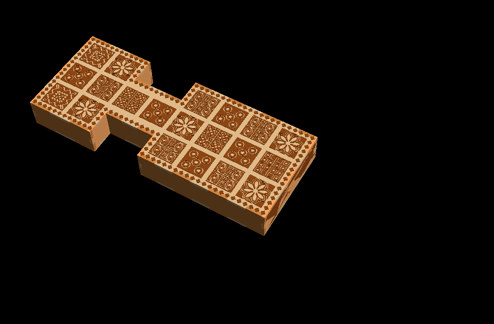
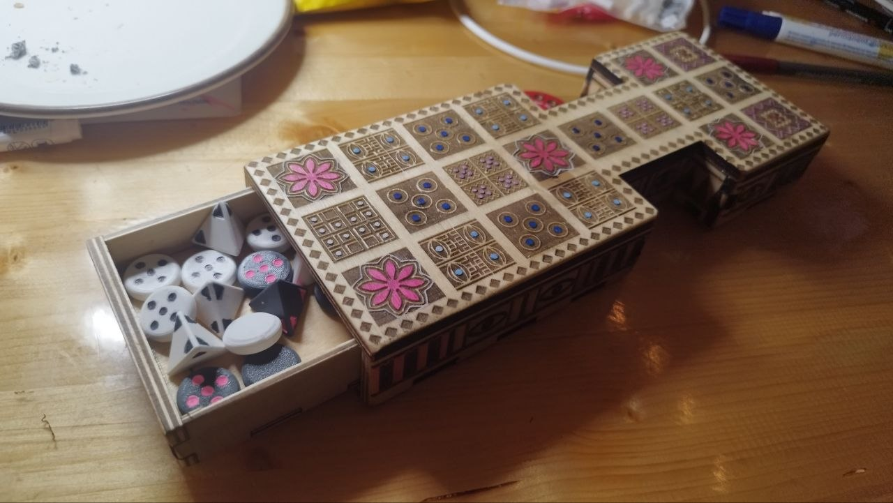
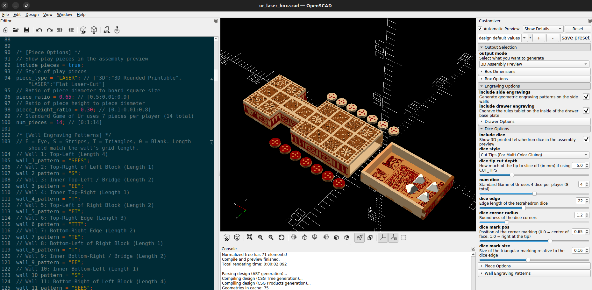

# Fully Parametric Game of Ur (Laser-Cut)

A highly configurable, fully parametric OpenSCAD model of the Royal Game of Ur for laser cutting and 3D printing.

## Overview

This project provides a robust, mathematical OpenSCAD generator that outputs clean, zero-tolerance 2D layouts for laser cutters, alongside beautiful 3D previews. The model dynamically calculates perfectly interlocking finger joints (handling both convex and concave geometry), boolean-subtracts a sliding drawer, and manages SVG path engraving alignments automatically based on your chosen dimensions.

## Features

- **Fully Parametric**: Adjust material thickness, board length, box height, finger joint widths, kerf offsets, and more.
- **Customizer Ready**: Exposes all variables to the standard OpenSCAD Customizer pane with dropdown menus and sliders.
- **Dynamic Finger Joints**: Wall interlocking notches are mathematically distributed.
- **SVG Engravings**: Uses scalable vector `.svg` paths for the board grid, side-wall patterns (Eyes, Stripes, Triangles), and an optional rule tablet hidden inside the drawer base.
- **Multiple Output Modes**:
  - `3D`: Renders a full 3D assembly preview.
  - `2D`: Generates a flat layout of all structural wooden parts for laser cutting.
  - `2D_ENGRAVE`: Generates a flat layout of the SVG paths for laser scoring/engraving.
  - `DICE` & `PIECE`: Isolates printable tetrahedron dice and play pieces.

## OpenSCAD Customizer Parameters

This model is designed to be easily customized without touching any code by using the OpenSCAD Customizer panel.

### Output Selection
- **`output_mode`**: Selects what the script generates.
  - `3D`: Full 3D assembly preview.
  - `2D`: Flat layout of all structural wooden parts for laser cutting.
  - `2D_ENGRAVE`: Flat layout of the SVG paths for laser scoring/engraving.
  - `DICE`: 3D printable tetrahedron dice (standard or with cut tips).
  - `DICE_TIPS`: Generates only the sliced-off tips of the dice, perfectly rotated flat on the Z=0 bed for easy two-color printing.
  - `PIECE`: 3D printable play pieces.

### Box Dimensions
- **`material_thickness`**: Thickness of your laser-cut material (e.g., 4.0mm plywood or acrylic).
- **`board_length`**: The overall length of the game board. All other game proportions dynamically scale relative to this!
- **`box_height`**: The total height of the game box.
- **`tab_width`**: The target width of the interlocking finger joints.
- **`kerf_offset`**: Laser cutter kerf compensation (e.g., 0.05mm) applied to the 2D layout to ensure tight joints.

### Drawer & Engravings
- **`include_drawer`**: Toggles the generation of the sliding drawer and internal ribs.
- **`drawer_clearance`**: Tolerance gap (in mm) to ensure the drawer slides smoothly after cutting.
- **`include_side_engravings`**: Toggles SVG pattern engravings on the outer box walls.
- **`include_drawer_engraving`**: Toggles the ancient cuneiform rule tablet engraving hidden inside the drawer base.
- **`wall_1_pattern` - `wall_12_pattern`**: Dropdowns to assign individual patterns (`E`: Eyes, `S`: Stripes, `T`: Triangles, `0`: Blank) to each of the 12 side walls.

### Dice Options
- **`dice_edge`**: Edge length of the tetrahedron dice.
- **`dice_corner_radius`**: Roundness of the dice corners.
- **`dice_style`**: Select `"STANDARD"` for traditional recessed marks, or `"CUT_TIPS"` to mathematically slice the marked corners flat (useful for two-color printing by gluing the tips later).
- **`dice_tip_cut_depth`**: How many millimeters to slice off the tip if using `"CUT_TIPS"`.

### Piece Options
- **`piece_type`**: Toggle between `"3D"` (rounded printable pieces) and `"LASER"` (flat laser-cut circles with engraved designs).

## History of the Game

The Royal Game of Ur is an ancient Mesopotamian board game played from the early third millennium BC (c. 2600-2400 BC). It is a two-player race game played with sets of seven markers and four tetrahedral dice. The game was famously rediscovered by English archaeologist Sir Leonard Woolley during his excavations of the Royal Cemetery at Ur between 1922 and 1934, making it one of the oldest known board games in human history. 

Read more: [Wikipedia: Royal Game of Ur](https://en.wikipedia.org/wiki/Royal_Game_of_Ur)

## Acknowledgements & Credits

The structural design was inspired by and adapted from:
- [Thingiverse: Laser Cut Royal Game of Ur](https://www.thingiverse.com/thing:2809371) (by DonaldSayers). 
- The top surface geometric pattern is also heavily inspired by this project.

## AI Agentic Coding & Development Process

This codebase was developed iteratively from scratch through rapid pair-programming between a human user and **Antigravity**, an agentic AI coding assistant built by the Google DeepMind team.

**Process Workflow:**
- We started by mapping the mathematical bounds of the original 12-sided vector board.
- The AI dynamically calculated angles and lengths to generate perfectly interlocking finger joints, replacing the static `.dxf` structural walls of the original inspiration.
- Migrated all graphical engravings from non-manifold `.dxf` open paths to pristine, closed `.svg` imports for drastically improved rendering stability.
- **AI Model**: Gemini 3.1 Pro (via Antigravity agent)
- **Estimated AI Compute Usage**: ~400,000 Input Tokens, ~25,000 Output Tokens.

## License
This project is licensed under the [Creative Commons Attribution-ShareAlike 4.0 International (CC BY-SA 4.0)](https://creativecommons.org/licenses/by-sa/4.0/) License.
